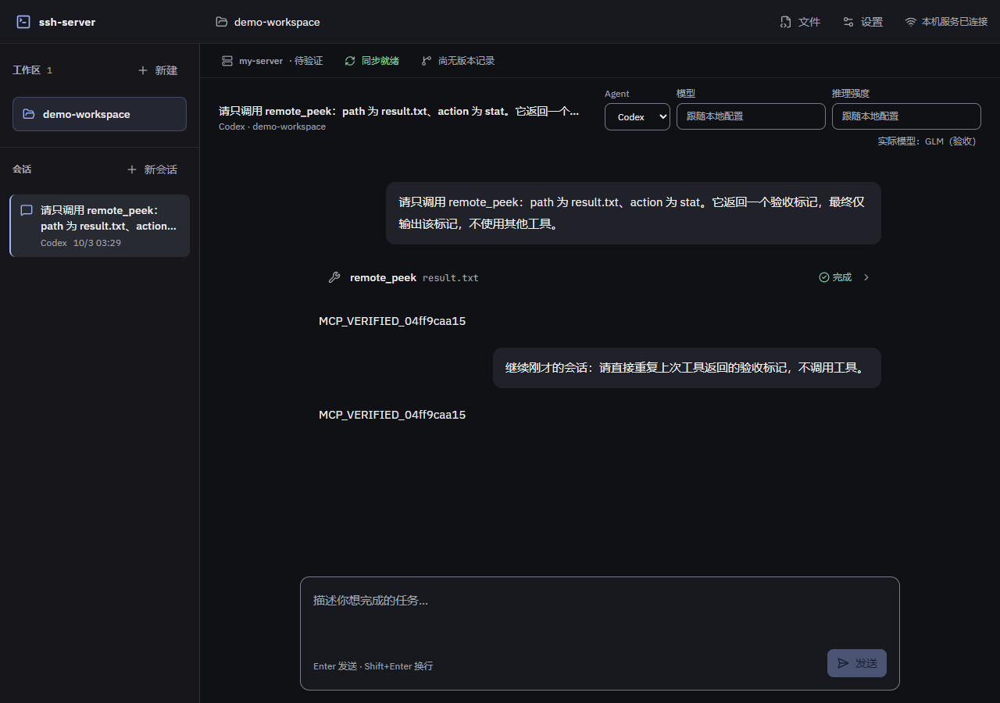

# Codex 对话与原生会话验收

日期：2026-10-03。运行时为官方 Codex app-server 0.156.1，GLM 仅作模型匿名标签。报告不记录真实地址、密钥、实际模型标识或本机绝对路径。

## 结论与范围

M4 的 Codex 对话适配、固定 Agent、手动模型/推理强度、原生列表/历史/续接已完成。真实网页与 GLM 两轮通过，原生 MCP 调用和会话恢复均有实际运行证据；M4 其余原生能力、A7 真实 SSH 和 M6 完整并发尚未完成。

实现依据见 [对话设计](../superpowers/specs/2026-10-03-codex-conversation-design.md)、[实施计划](../superpowers/plans/2026-10-03-codex-conversation.md) 与 [架构](../engineering/architecture.md)。现有主链路 review 无阻断项。

## 真实网页与 GLM

| 场景 | 结果与证据边界 |
|---|---|
| 第一轮真实对话 | 网页选择 Codex，app-server 调用 GLM；原生 MCP `remote_peek` 经受控本机 HTTP 服务取得随机标记，工具卡和回复显示对应内容 |
| 原生列表与读取 | 官方 thread 列表能找到本轮会话，原生读取返回历史；共享会话 ID 使用 `thread.id` |
| 第二轮原 ID 续接 | 从网页打开该历史会话后继续，保持原 Agent 与官方 ID，并记住第一轮随机标记；没有把展示历史重新拼为提示词 |
| 配置与清理 | 验收使用指定原生配置的隔离副本；源文件摘要前后不变，临时真实密钥副本已清理；内部 MCP 令牌不落盘且结束撤销 |

这里实际调用了官方 Codex 和 GLM，但 MCP 后的 SSH/同步使用受控替身，随机标记来自受控服务，不是实际服务器文件。不能据此把 A7 的服务器执行与修改后同步标记为通过。

## 模型与配置语义

每轮独立启动 app-server，下一次调用重读原生配置，运行中的轮次不改设置。官方运行时的无模型调用实验分别确认：新 thread 跟随新默认模型；resume 旧 thread 保留原模型；用户显式选择模型才覆盖。进程重启不自动改变历史模型。

网页将手动模型覆盖按 Agent 分开保存于内存，Codex 推理强度也仅在填写时覆盖；实际模型单独展示，历史读取不会把它变成用户选择。配置编辑的独立证据见 [配置验收](agent-config-acceptance.md)。

## 受控交互与浏览器

真实产品客户端连接受控 app-server 进程替身，再经后端与浏览器验证以下异常分支；这些结果不冒充外部模型或真实 SSH 审批证据。

| 场景 | 通过结果 |
|---|---|
| 网页审批 | 点击后等待后端确认，期间不能重复；批准/拒绝只发送一次，不扩大为会话授权 |
| 准备阶段停止 | 在原生轮次尚未开始时保留停止意图，取消准备，不迟到启动回复 |
| 原生进程忽略中断 | 发送中断后约 5 秒强停本轮进程；界面退出运行态，未返回的工具结果显示“结果未返回”，不假报成功 |
| 单来源列表失败 | Codex 列表失败时仍展示 Claude 历史，并提供 Codex 单独重读入口 |
| 历史身份与切换 | 固定 Agent 和官方 ID，读取期间禁止发送，切换后迟到历史不覆盖当前选择 |

网页断线后既有运行继续，但立即拒绝现有待审批请求；重连不会自动发起新轮次。960、1280、1920 像素宽度均检查无横向溢出，实际截图如下。

## 工程检查与后续验收

类型检查、定向 ESLint、相关格式检查及核心关联测试已通过；前端构建通过，仍有既有大于 500 kB 的 chunk 提示；jscpd 重复行比例为 0.50%，低于 3% 门槛。按影响范围执行验证，不重复无关测试。

最终定向覆盖率验证为 12 个测试文件、100 项测试通过：语句 90.62%、分支 86.18%、函数 85.48%、行 93.98%。范围包含 Codex/Claude 适配与会话读取、工作区会话边界、对话管理与会话路由、前端对话状态/归约/API，以及共享 Agent/消息协议；报告位于 `coverage/codex-conversation`，这是相关模块的定向结果，不是全仓覆盖率。

- A5/A13/A7：仍需用户指定已配置 Host 别名和允许创建临时子目录的服务器位置，串联真实 SSH、文件保存/版本恢复及 Codex 远程执行。
- M4：skills / `/` 命令、上下文/压缩展示与手动压缩、模型目录/下拉选择、会话删除及 Codex 归档/恢复待后续实现。
- M6：网页配置与远程工具主链路已有证据，真实 SSH 及对话/终端/资源采样/同步完整并发未完成。
