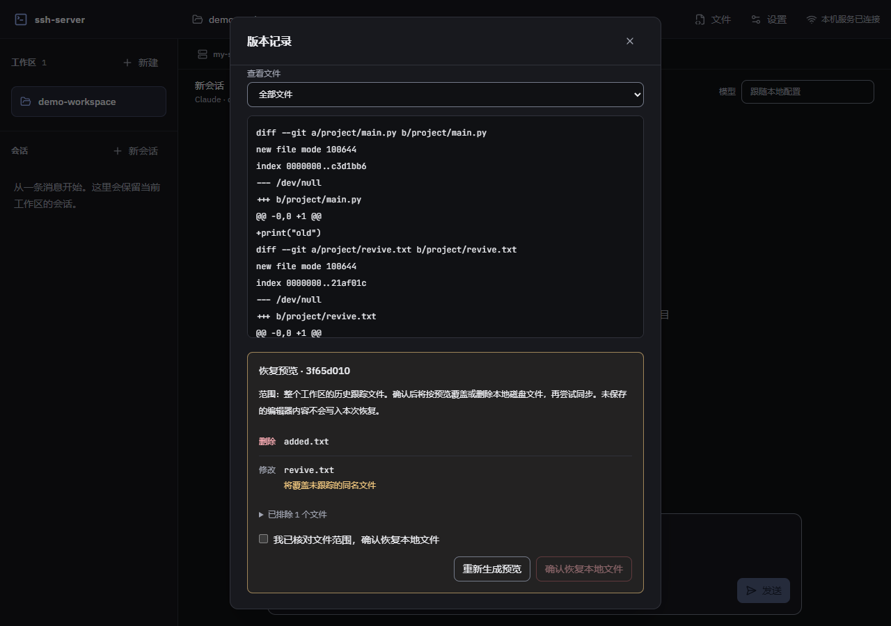

# 本地版本记录验收

日期：2026-10-03。范围为 F6 的本地 Git 和网页入口；A5 的服务器恢复结果仍待真实 SSH 串联复验。

## 已实现

- 打开工作区时幂等初始化 Git，不自动提交；复用父仓库内子目录与 linked worktree，操作限定当前工作区。
- 状态摘要和按需详情支持改动/排除清单、自填说明、保存版本、每页 30 条历史与单文件差异。小型二进制可记录，遵守同步过滤、大小阈值和 Git 忽略。
- 真实索引锁、隔离索引和 HEAD 条件更新共同保护提交。采用当前工作树内容，保留工作区外和排除文件已有的暂存修改/删除；文件与目录互换若会影响受保护项则拒绝。
- 沿用 Git 行尾、属性与身份配置；要求 Git 2.43+，旧版明确提示升级，避免静默忽略目标属性。不创建空版本，不改写全局配置、不推送。全仓库未合并索引、合并/变基等进行中状态会阻止写操作。
- 恢复先预览新增、修改、删除、排除和同名未跟踪覆盖，再勾选确认。令牌绑定当前快照、目标提交、范围及最终操作清单，陈旧确认被拒绝。
- 恢复只修改工作树，不移动 HEAD、不修改实际索引；保留不冲突的未跟踪文件和编辑器未保存缓冲。失败尝试回滚，无法全部恢复时返回受影响路径。
- 本地恢复成功后进入已有同步流程，独立显示同步完成、删除待确认、冲突或失败；同步完成不承诺远端内容未经其他操作再次改变。

## 验证范围

- 14 项版本服务/路由核心测试通过。临时真实 Git 仓库覆盖初始化、过滤和小二进制、无空提交、父仓库/排除暂存保护、并发与陈旧确认、行尾/目标属性、链接及嵌套仓库、历史分页、工作树差异、整区/单文件恢复、索引安装失败后的 HEAD 回滚和部分失败。
- 审核发现的结构替换暂存丢失、空说明历史解析、作用域外未合并索引、结构恢复清单变化共用令牌均纳入核心回归。
- 40 项关联测试通过，范围为前端 API/对话/同步调度、文件服务及文件/同步路由；沿用此前全仓基准，未重跑无关测试。
- 本次版本模块及路由的定向覆盖率：语句 87.26%、分支 76.49%、函数 97.41%、行 93.72%，满足现有阈值；不将此结果表述为全仓覆盖率。并发断言只要求一个成功和一个陈旧拒绝，不依赖异步请求的完成顺序。
- 浏览器使用真实 Git、版本服务和 Fastify 路由：网页保存采用最新内容，保留外部及排除项暂存；历史/diff、陈旧恢复拒绝、单文件/整区恢复、未跟踪覆盖与保留、HEAD/索引不变均通过。同步成功、删除待确认及失败使用受控替身验证。
- 960/1280/1920 宽度、对话框内滚动和关闭后焦点恢复已核对；版本详情按需加载。预览状态基准与后端确认令牌分别处理，避免误判全部预览过期。
- 类型、相关 ESLint/格式、构建及差异检查通过；重复行约 0.56%。版本详情约 16.47 kB、按需加载；主包约 921.37 kB、编辑器约 655.04 kB 的既有体积提示仍保留。

## 边界

- A5、A13 仍需用户指定已配置 SSH Host 与允许创建测试子目录的位置，完成网页保存/恢复到真实服务器的串联验收；本记录不替代实际传输结论。
- 单次工作树快照与恢复内容各上限 128 MiB、最多 10,000 条路径，单文件遵守工作区同步阈值；索引读取上限 32 MiB，差异显示上限 512 KiB。超限有明确错误，不无限读取项目数据。
- Git 锁保护索引与提交，外部编辑器仍可能在最终文件检查和原子替换之间修改文件；不宣称跨进程文件写入具备完整事务保证。
- 本次按现有版本详情实现；拖动分栏、diff 行内评论等目标界面能力仍在后续范围。
