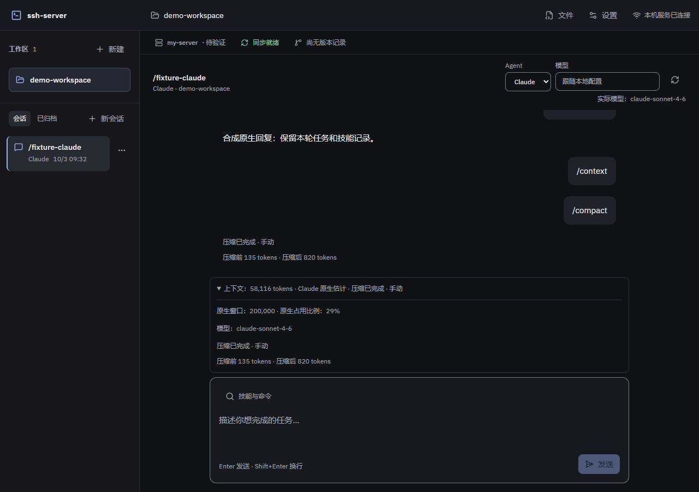

# 原生能力验收

日期：2026-10-03；开发基线：`49db632`。本阶段接入技能/命令目录与调用、模型候选、原生上下文及压缩状态，设计和接口见 [原生能力设计](../superpowers/specs/2026-10-03-native-capabilities-design.md) 与 [实施计划](../superpowers/plans/2026-10-03-native-capabilities.md)。外部模型验收仅记录 GLM 名称，不记录真实地址、密钥或具体型号。

## 已实现范围

本记录对应原生能力接入阶段；后续已补齐输入 `/` 自动展开，增量行为与验证见[输入补全验收](slash-completion-acceptance.md)。以下保留该阶段的实际范围和验证数字。

| 能力 | 行为与边界 |
|---|---|
| 目录与技能 | 按工作区/Agent 发现，按钮搜索选择、来源/限制提示及刷新；网页仅传稳定 ID，后端解析后在实际原生实例再次验证。未知、禁用、过期或歧义项明确拒绝，目录失败不阻断普通消息 |
| 原生命令 | 支持直接 `/name 参数` 解析、两类 compact 和 Claude context；要求已有会话，Codex compact 不接受附加参数。Codex context 提示使用 CLI，其余未接入命令说明限制 |
| 模型建议 | 原生模型/推理强度候选与手动输入并存；目录默认项、历史模型和默认 effort 不自动变成覆盖参数。配置保存仅失效能力元数据缓存 |
| 上下文 | Claude 使用 summary 控制查询并标明原生估计；Codex 使用原生 last 用量与通知窗口，不使用累计 total 或配置窗口推算占用。仅展示 Claude 原生提供的比例，缺失为不可用 |
| 压缩 | 保留原生手动/自动来源与成功、失败、取消状态；接受请求不等于完成，须确认本轮原生压缩结果。历史保留原生边界，结束未确认的压缩不假报成功，也不被新普通轮次复活 |
| 生命周期 | Claude 每轮单条输入流，result 后限时读取 summary 并关闭；纯 context/compact 不触发轮次后同步，普通消息/技能继续同步。切换与迟到结果隔离，管理中的目标仍禁止发送 |

输入 `/` 自动展开候选尚未实现，仍保留为界面目标；当前完成的是按钮搜索选择与后端直接 slash 解析。

## 原生与外部模型证据

真实 Claude CLI 2.1.286 / SDK 0.3.286、Codex app-server 0.156.1 配合合成模型协议，已验证技能展开、context、compact 的成功/失败/取消以及同步边界。目录和 summary 查询不发送模型消息，但原生初始化可能探测服务，不能据此声称完全无网络。

GLM 增量通过两次真实原生适配器运行：技能由原生目录发现，回复命中仅存在于临时 SKILL 正文的随机标记，并产生 `codex_native` 上下文；手动 compact 收到原生接受、item 开始/完成及 turn 完成通知，状态从 running 到 completed，轮次未报错。该结果证明所选技能与手动压缩实际进入原生运行时，不以仅收到 RPC 接受响应替代完成。

验收使用指定配置的隔离副本，替代配置及正式配置的源摘要前后不变，临时含密钥副本已清理。测试未操作用户历史或真实 SSH 目标；本阶段 GLM 结果不替代 A7 的服务器执行与同步验收。

## 网页与状态验证

网页经真实 HTTP 能力目录、TurnManager 和原生 CLI/SDK，连接本机合成 API 完成以下检查：

- Claude：技能选择仅发送 ID，可空文本调用；搜索 Enter 不发送消息；context 不触发模型消息；compact 成功并且不重放普通消息。
- Codex：技能仅 ID/空文本、原生上下文、默认 model 不传、CLI context 限制、手动模型刷新后不被覆盖、compact 附加参数禁发、真实失败事件展示、停止后取消，以及目录 503 后普通消息仍可发送。
- 两类界面均检查 960/1280/1920 宽度，无横向溢出；Codex 选择器的限制文案与布局已实际查看。下图为 Claude 原生上下文和压缩状态的 1280 像素截图，数值来自本次合成协议验收。

两项核心 P2 问题已由原 reviewer 复现并复核关闭。旧压缩摘要的修复保留历史未确认边界；新的普通轮次不会重新显示旧压缩进行中。

## 工程结果

以下四组不重叠，合计 164 项测试通过；沿用此前可靠全仓基线，没有重复无关测试或改写旧验收数字。

| 分组 | 测试数 |
|---|---:|
| Claude | 46 |
| Codex | 40 |
| 前端 | 43 |
| 路由 / TurnManager / shared | 35 |

已记录的定向覆盖率分别为：路由/TurnManager/shared 语句 95.43%、分支 90.62%、函数 95%、行 98.91%；Claude 语句 88.08%、分支 81.28%、函数 89.28%、行 91.71%。这些仅是相应模块的结果，不是全仓覆盖率。

构建通过，主包 944.63 kB、gzip 289.24 kB，保留既有大于 500 kB 的 chunk 提示；jscpd 为 0.50%。前后端及共享类型、受影响文件 ESLint、格式及 P2 回归已通过。

## 仍待完成

- 输入 `/` 时自动展开候选及补全；未接入的原生命令仍按目录显示限制。
- 实际长会话负载下的自动压缩、续接与状态体验，不以短程手动压缩或合成协议替代。
- A7 与 A5/A13 的真实 SSH 串联、A8 的 VS Code/CLI 独立界面刷新，以及 M5/M6 的终端、资源和完整并发等既有待办。

项目仍在推进，本阶段完成不代表 M4 或整体需求全部完成。
