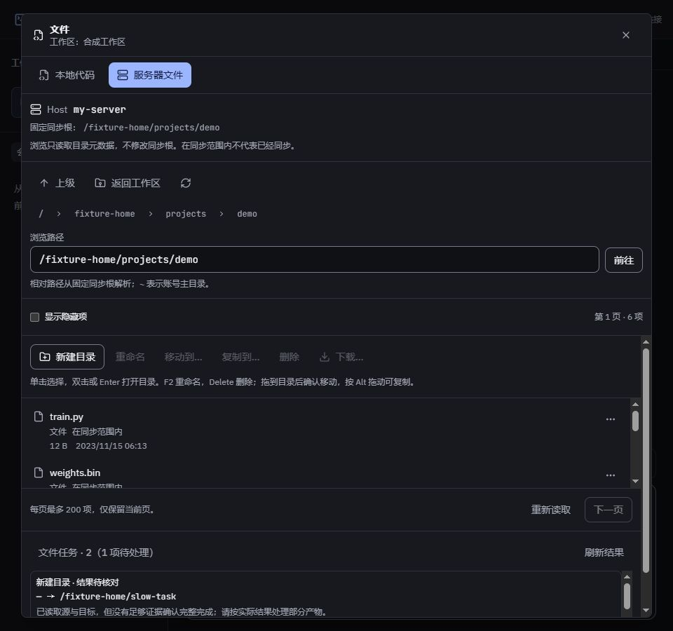

# 服务器文件操作与下载阶段验收

日期：2026-10-04。对应 F10.3–F10.7 的操作与任务基础，接续[浏览阶段](remote-files-browser-acceptance.md)。同步路径协调按[实施计划 Task 4](../superpowers/plans/2026-10-03-remote-files.md)继续，本文不将阶段实现当作 A20–A23 全部通过。

## 已接入能力

- 新建目录、重命名、移动、复制、删除先预检，核对服务器、源与目标后显式确认；默认不覆盖同名目标、不合并目录。预检两分钟失效，提交前再次核对身份、配置和对象。
- 固定 Python 处理器只使用远端已有标准库与 Linux 原语，目录描述符不跟随链接父路径；配置根、解析后的实际根及其祖先均受保护，执行时重新解析配置根。复制处理链接本身，内容与结果核对在服务器完成。
- 同文件系统移动采用原子不覆盖重命名；跨文件系统依次复制、核对副本、移除源。扫描限制为 50000 项、64 层、30 秒元数据预算，预算不足阻止提交；正文传输和哈希时间由任务总截止时间控制。失败或取消可能留下部分产物，不承诺回滚。
- 任务先原子持久化再派发，重复提交不重复执行，相同 SSH 身份的相交路径排队，最多四项并行。重启不自动重放写操作，损坏记录保留并告警。关闭面板不取消已提交任务。
- 请求可能派发后即使未收到首条阶段事件，取消或断线仍标为“结果待核对”。结果检查只读取实际源与目标，证据不足保持未确认；跨文件系统移动优先使用保存的正文证明，不仅凭设备号判断结果。
- 普通文件通过独立 SFTP 通道流至 HTTP，打开前与打开句柄后复验属性；取消不影响浏览通道。64 KiB 高水位控制背压，但 ssh2 可能继续预取，不能作为硬内存上限。下载不会进入镜像、同步或 Git。
- 网页提供可见按钮、右键菜单、目录选择器、键盘和拖动确认；任务详情独立滚动，隐藏时停止轮询。支持保存选择器时逐块写入，否则交给下载管理器，网页不将请求交接描述为磁盘保存完成。

当前阶段限制：预检按实际 SSH 身份核对所有已配置工作区并显示同步影响；涉及同步范围的写操作禁止提交。超大、排除或 Windows 无法表示的普通文件仍可仅在服务器管理。该门槛会由 Task 4 的协调事务替换，不能用普通双向同步代替路径迁移。

## 核心审查与工程证据

独立静态审查及实现复查修复了配置根链接改指向、派发前后中止分类、硬链接删除自身 ctime 变化、递归扫描预算、同设备跨 bind mount 恢复证明、仅服务器名称分类和退出持久化收尾等边界。最终独立审查没有剩余可行动问题；静态审查不等于真实服务器验收。

操作、执行器和下载新增 13 项核心测试通过，覆盖确认门槛、重复提交、持久化、相交排队与取消、陈旧配置、中断/重启、结果证明、固定命令编码，以及本机真实 ssh2/SFTP→HTTP 下载。下载使用 4 MiB 合成普通文件，暂停消费者时流缓冲不超过 128 KiB，未整文件预读；取消下载后仍可浏览。预检测试额外核对超大且 Windows 无法表示的名称不错误触发同步校验，该文件 9 项定向复验通过。

上述定向覆盖率：语句 88.96%、分支 78.46%、函数 90.10%、行 94.76%，只代表指定操作与 SSH 模块。server/shared/web 类型、定向 ESLint 和网页构建通过；生产主包 1072.51 kB（gzip 331.86 kB），既有 chunk 提示保留。

本机阶段门禁 `npm run check` 通过：551 项测试通过、5 项 Linux 专用测试跳过；全仓语句 85.31%、分支 79.62%、函数 87.51%、行 89.22%，重复率 0.40%。这次全量检查用于阶段整合，后续仍按改动范围增量验证。

另有 5 项 Linux 实际文件系统测试，覆盖不覆盖及根/链接保护、复制正文和链接本身、硬链接删除、陈旧预检、扫描预算及原子移动核对。Windows 按平台跳过，Python AST 检查通过；Linux 执行结果由本阶段 PR CI 单独确认，未执行前不记为通过。

## 网页验收

内置浏览器使用生产构建、本机真实 ssh2/SFTP 握手与合成元数据；文件写操作执行器为内存替身，只用于交互验收。

1. 在同步范围内重命名显示影响，确认/执行禁用；工作区外新建目录先预检、勾选后提交，任务显示完成，手动刷新可见新目录。
2. F2 打开重命名，右键操作菜单可用；嵌套目录选择器返回完整目标路径，关闭后恢复触发按钮焦点。打开操作窗口优先聚焦路径输入。
3. 拖动目录到另一目录触发移动确认窗口，没有直接执行变更；临时拖动诊断代码已移除。
4. 提交慢任务后关闭面板，重新打开仍能查询运行状态；取消后显示“结果待核对”，再次核对源与目标不存在时仍保持未确认，不将不足证据判为成功。
5. 960/1280/1920 宽度无页面横向溢出。实际截图发现展开任务挤压目录列表，已限制任务区高度并为目录列表保留最小高度，操作区在高度不足时滚动；最终布局单独复验。

最终复验的目录可视高度分别为 128、128、160.75 像素，三个宽度均无横向溢出。结束时审计为 0 个独立 SFTP 通道、0 个目录句柄；临时标签页已关闭、viewport 已恢复，验收服务正常退出。

## 待验收范围

- 本机 Linux helper CI、真实 SSH 的同/跨文件系统操作、真实权限及断线恢复结论分别记录，不以网页内存替身冒充。
- 浏览器真实保存位置选择、磁盘保存及下载管理器取消尚未验收；已通过的是 SFTP→HTTP 流与中止边界。
- 同步目录移入/移出、跨工作区、混合目录、编辑缓冲和失败恢复待 Task 4；完整 F10 及 A20–A23 保持未完成。
- 真实 SSH 仅使用确认的临时目录；真实目标、账号和认证配置不写入本仓库。
