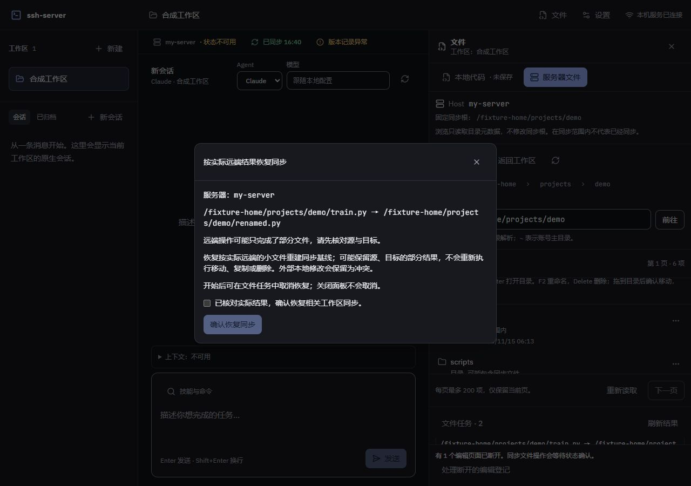

# 服务器文件同步协调阶段验收

日期：2026-10-04。对应 F10.7–F10.9，接续[操作与下载阶段](remote-file-operations-acceptance.md)。同步协调与编辑保护已接入，本页区分本机核心证据、合成网页与后续独立真实 SSH/rclone 证据；当前剩余边界见文末，不沿用早期等待目标的状态。

## 已接入行为

- 预检按实际 SSH 身份确定相关工作区，使用有界元数据清单逐项判断源/目标的小文件、排除项和混合目录。扫描不完整拒绝执行；完整路径各分量、既有远端文件与本地空目录参与大小写及文件/目录碰撞检查。
- 按工作区 ID 固定顺序取得同步事务，排队后复验配置。执行前同步就绪、创建独立任务镜像与原始文件身份/摘要清单，并持久保存任务阻断；普通同步、初始化及远程执行不能绕过阻断。
- 相关工作区全部已知编辑器先预留，再由客户端锁定并报告最新 dirty/busy。未保存、忙或未知状态阻止派发。WebSocket 只传路径与状态，存在性登记持久化，不发送或保存编辑正文；断线/重启后需同 ID 重连或明确确认放弃断开登记。
- 远端已完成和同步待恢复分别持久记录。恢复单向拉取实际远端小文件，核对后在普通固定镜像重建远端优先 bisync 基线，再按原始身份回写本地，避免普通同步重新上传旧路径。
- 外部本地修改保留为冲突，普通同步继续暂停；文件增长超过阈值时直接保留原文件为本地副本，不读取其大正文。Git 索引与历史不参与基线重建，不自动提交。
- 恢复只接受严格的 `{ confirmed: true }`，不重放移动、复制或删除。可以取消恢复，关闭面板不取消；取消后立即重试等待前次清理完成，退出等待初始化持久化与中止收尾。新增无关工作区不阻止旧任务恢复，原相关配置和 SSH 身份仍须一致。

## 核心审查与工程证据

独立静态审查发现并修复完整路径大小写/占用碰撞、无关工作区使恢复失效、外部文件增长超限无法形成冲突的问题。最终核心复查没有剩余 Critical/Important；后续取消重试专项复查发现恢复初始化未纳入退出等待，已用确定失败的案例复现并修复，专项复核无剩余 Critical/Important。静态审查不替代真实传输验收。

新增核心用例覆盖混合目录分类、固定锁序、迁移后普通同步不上传旧路径、失败/重启恢复不重放、外部编辑与超限冲突、既有名称碰撞、取消后立即重试、退出收尾，以及编辑器最新状态、断线持久登记、重连和显式释放。真实本机 WebSocket 路由额外验证严格确认、未知工作区、携带正文和超限消息断连；测试使用临时目录和合成目标。

本机阶段门禁 `npm run check` 通过：566 项通过、5 项平台跳过，语句 85.15%、分支 78.58%、函数 86.99%、行 89.08%，重复率 0.40%，没有降低覆盖率门槛。随后退出生命周期修复的任务、协调和路由 3 文件 18 项增量验证通过；类型、ESLint 与格式按实际变更复验。生产网页构建通过，主包 1073.19 kB（gzip 331.97 kB），既有大 chunk 提示保留。

传输接口补充核心契约验证：拒绝将任务拉取或远端优先重建直接指向工作区，单向拉取只接受任务镜像，固定镜像重建使用 `path2` 并保留大小过滤。关联 rclone 7 项通过；此证据检查进程参数和范围保护，仍不等同实际 rclone 传输。

最终提交 `f4eebd7` 对应 [CI 37190534872](https://github.com/Heaven-y/ssh-server/actions/runs/37190534872) 双平台门禁均成功：Windows 568 项通过、5 项平台跳过，语句覆盖率 85.33%；Linux 570 项通过、3 项平台跳过，语句覆盖率 85.12%，包含 Linux helper 的实际文件系统用例。代码与文档通过 [PR #4](https://github.com/Heaven-y/ssh-server/pull/4) 按 `--no-ff` 阶段整合，完整 F10 仍保留下述验收缺口。

## 网页验收

使用生产构建、本机真实 ssh2/SFTP 元数据服务，以及真实工作区文件、同步管理器、协调器、任务与编辑登记路由。服务器写执行器和 rclone 传输是受控替身，实际操作本机临时镜像；未连接用户服务器或调用模型。

1. 本地 `train.py` 有未保存缓冲时，重命名预检显示源/目标各 1 个同步文件，勾选后允许提交；任务被最新脏状态阻止派发，切回本地正文保留，保存后可继续。
2. 远端重命名完成而拉取失败时显示同步待恢复。恢复窗口默认禁止确认，说明实际远端、部分结果、外部冲突和不重放；确认后可从任务区取消，再次确认恢复显示完成。
3. 审计核对服务器写操作执行数为 **1**。恢复后的普通同步没有重新生成 `train.py`，本地与远端 `renamed.py` 保留已保存正文；后续编辑/保存仅上传新路径。
4. 编辑保护连接断开时正文保留，CodeMirror 禁写，保存/切换文件入口禁用，显示断开登记确认窗口。重连同 ID 后可继续保存；未确认时未清除登记。
5. 960/1280/1920 × 900 视口均无页面横向溢出，恢复弹窗与断开登记入口可见，截图逐张实际检查。关闭面板后登记为空，SFTP 通道和目录句柄均为 0；临时标签页关闭、视口恢复、验收服务正常退出。

合成服务未实现的 SSH 状态、版本和原生能力路由不计入这些功能的验收。网页证据不验证实际 rclone 清单迁移或真实服务器文件系统行为。

## 2026-10-05：明确恢复与任务收尾

终端整合后的main Linux CI暴露既有取消恢复测试失败，本机复现同一断言。根因是任务先更新可见终态，再完成持久化和controller清理，此窗口内的明确恢复被视为仍在运行而未启动。

新增内部settling状态，只在最终结果持久化/失败收尾时设置；恢复等待取消或settling的执行结束，再复查controller，正常同步拉取期间立即返回原状态。该状态不进入任务文件或公开协议，避免仅凭sync_pending判断收尾：远端操作完成后的正常拉取也使用该阶段。

一次独立核心Review指出初版按phase判断会阻塞正常拉取，已用核心回归复现后修正。既有取消/立即重试与新增正常拉取恢复两条路径均通过，关联文件8项通过，类型、ESLint和差异检查通过；远端写操作仍只执行一次。

## 后续真实证据与剩余边界

上述本机证据保持原范围。后续实际SSH/rclone已补齐同步文件移入/移出、混合目录迁移、固定镜像基线及普通同步、同/跨文件系统大文件、Firefox实际磁盘保存与取消、向导/终端/资源并发，见[完整链路验收](real-workflow-acceptance.md)。跨已配置工作区的固定锁序和恢复边界沿用核心回归，不扩大为所有真实跨工作区组合。

真实权限拒绝、预检后源移动/内容变化/同名目标出现、独立SSH连接中断、任务持久重开与核对不重放，见[失败验收](remote-file-failure-acceptance.md)。单连接证据不扩大为共享池或全网络故障。协调阶段已两级整合为feat `9387ee0`/main `76a9cee`，[main双平台CI](https://github.com/Heaven-y/ssh-server/actions/runs/37190899240)成功。

Edge系统保存选择器仍未验；独立客户端和原生OS输入法边界见[剩余范围](../engineering/remaining-scope-audit.md)。用户已授权使用既有目标和独立随机测试根，连接与认证信息仅保留本机ignored材料，不再等待重复确认。
