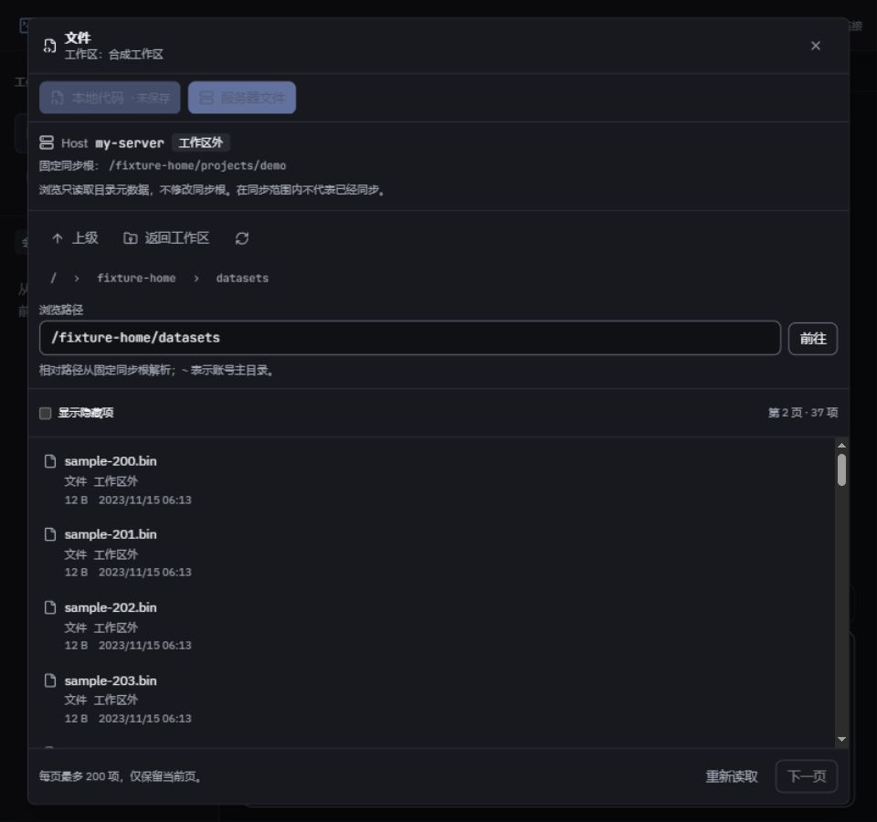

# 服务器文件浏览阶段验收

日期：2026-10-03。本阶段对应 F10.1/F10.2；同服务器写操作、下载和同步路径协调继续按[实施计划](../superpowers/plans/2026-10-03-remote-files.md)推进。

2026-10-04 增量：将前端目标登记、连接和释放抽为独立生命周期模块，重连保留原绑定，取消立即传至创建会话的 HTTP 请求，传输层仍返回迟到 ID 时继续关闭对应资源。补充连接生命周期及 API 核心回归；本机技能执行记录统一排除于源码检查和版本控制，防止临时验收脚本影响检查或泄露运行时配置。

本轮定向网页回归 17 项通过；此前后端真实 HTTP/SFTP 测试已覆盖请求中止与迟到通道清理，本轮修复将网页创建取消接入该链路。一次全仓覆盖率检查通过 536 项测试，语句 85.24%、分支 79.76%、函数 87.68%、行 89.05%，保留原门槛。类型、ESLint、Prettier、重复率（0.45%）及网页生产构建通过；这次扩展验证用于解决旧 PR 的覆盖率失败，后续仍按改动范围验证。

远端平台差异：`ca468a7` 的 Windows CI 通过，Linux 功能测试通过但语句覆盖率为 84.99%（4679/5505），仍差一条语句达到 85%。补充断线后拒绝新请求和幂等资源清理的 SFTP 核心回归，两项 SFTP 测试、定向 lint/格式通过；远端结果待新提交的 CI 确认，不下调门槛。

## 实现与验证

- 文件面板区分本地代码与服务器文件，默认定位固定同步根，允许同一 SSH 账号浏览工作区外目录；提供面包屑、路径输入、返回上级/工作区、隐藏项与文件信息。
- 目录按 SFTP 句柄逐批读取，每页最多 200 项，前端只保留当前页；游标重试不重复推进。中途读取失败使游标失效并要求重新读取，不从不确定位置继续。
- 打开面板即登记目标；旧绑定在 Host 实际地址、账号或信任记录变化后不能通过重新连接访问新目标。登记不打开 SSH 或读取认证秘密。
- HTTP 中断、排队、配置读取、SSH/SFTP 打开均有取消及总截止时间；当前目录拥有独立通道，停止该目录不关闭共享 SSH。
- 独立核心审查发现并修复：分页中途失败丢项、跨重连身份丢失、取消未传播和总超时遗漏；同时修复临近闲置期限发起读取时被计时器关闭，以及宽窄断点重建面板内容。
- 新增 14 项核心测试，其中 7 项使用本机真实 ssh2 握手与 SFTP 协议、合成元数据。包含 EOF 协议适配、237 项分页、正文/命令零调用、资源释放、身份变化、慢读取取消和真实 HTTP 中止。测试暴露按句柄 `readdir` 的 EOF 为状态码 1，已正确转换。
- 加上受影响连接池/连接解析回归：6 文件、32 项通过。定向覆盖率：语句 90.76%、分支 82.42%、函数 87.61%、行 96.25%。该数字只代表新增模块和相关 SSH 模块，不作为全仓覆盖率结论。
- server/web 类型检查、定向 ESLint/Prettier 与网页生产构建通过。主包 1,071.13 kB（gzip 331.41 kB）；既有大 chunk 提示仍在。

## 浏览器结果与边界

使用内置浏览器、生产构建和本机合成 SFTP 服务，实际核对以下行为：

1. 目录外读取按 200 + 37 项分两页，末页无下一页；固定同步根保持不变。
2. 本地未保存内容在双视图、聊天工作区切换和 960/1280/1920 宽度之间保留；跨 1280 断点保留外部目录和页码，三个宽度均无页面横向溢出，截图已查看。
3. 路径输入支持 Enter；无权限路径显示固定错误；链接只显示自身信息，隐藏项可切换。
4. Host 实际身份变更后旧会话失效，重新连接仍被 `target_changed` 拒绝，本地编辑缓冲保留。
5. 服务端审计显示文件正文读取和远程命令均为 0，目录句柄与 SFTP 通道已释放。全页已有的工作区切换会发起同步初始化请求；目录导航没有新增同步请求，不能将整个页面描述为“从不请求同步”。

未将合成环境的 SSH/同步/版本状态占位接口当作对应功能的验收。尝试关闭带未保存内容的面板时，内置浏览器自动化被原生确认框阻塞，未计入“取消关闭”交互通过；临时标签页及本机验收服务已关闭。真实用户服务器及 A20–A23 仍待指定目标和后续功能，不以本次测试代替。

