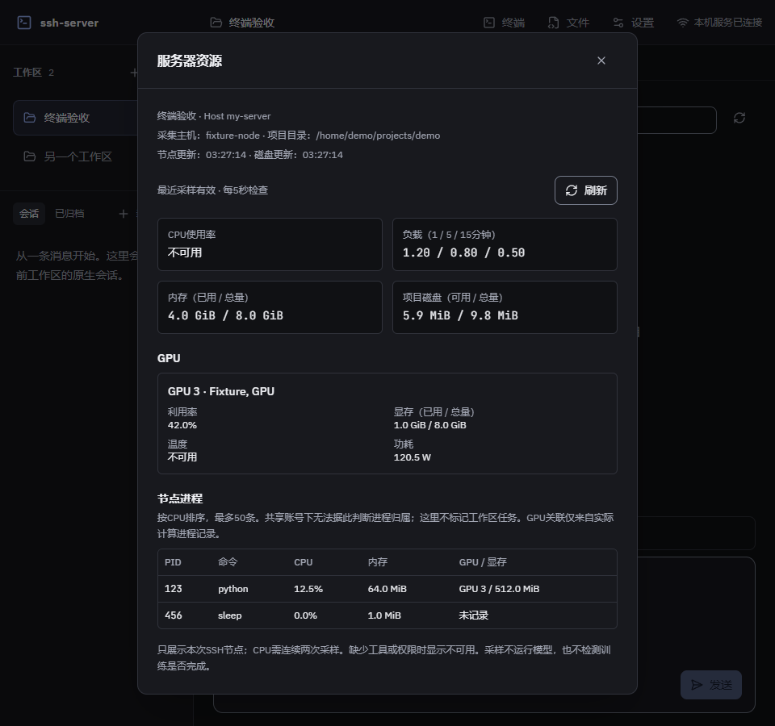
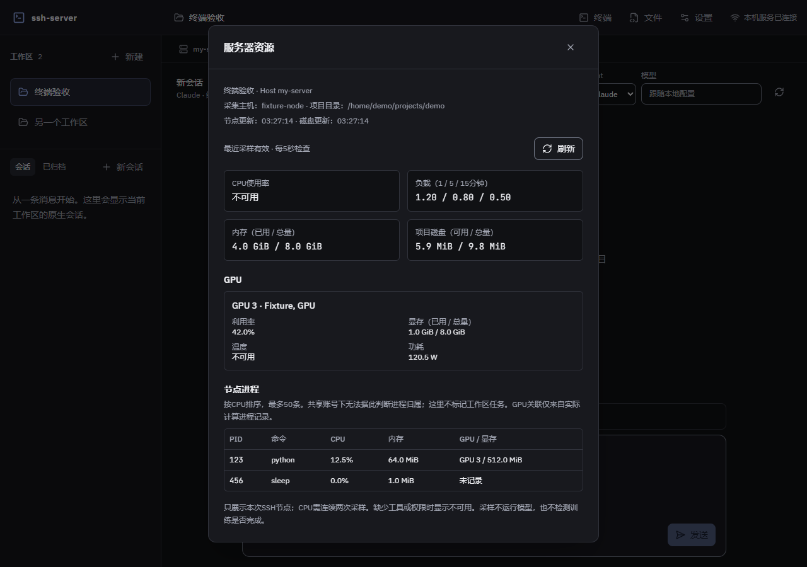
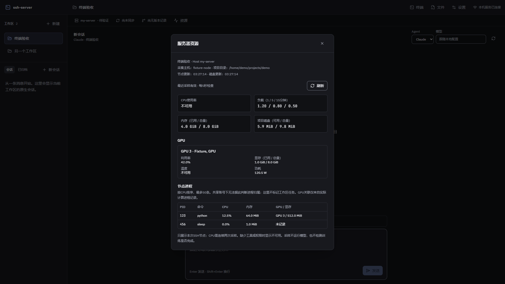

# 资源面板验收记录

日期：2026-10-05。对应 F9、A18。设计与取舍见[资源设计](../superpowers/specs/2026-10-05-resources-design.md)和[决策记录](../engineering/resources-decisions.md)。真实连接参数只存在本机 ignored 文件，不写入仓库。

## 实现与核心审查

后端沿用 SSH pool，以独立只读 exec 采集宿主和目录指标；按实际认证身份共享有界缓存，目录磁盘独立。HTTP 返回固定目标和独立采样时间。网页资源详情保留打开时目标，可见时检查、关闭销毁订阅，失败保留旧数据并标记过期。

一次独立审查覆盖目标失效、别名共享与目录隔离、缺失工具、超时/输出/取消、网页生命周期。发现一项 P2：工作区在连接解析等待中变化时，解析前事实仍被返回。修复为解析完成后重新读取工作区并检查认证代次；目录修改和工作区删除两条回归均先失败、修复后通过。没有 P1 或单列 P3。

11 项核心回归覆盖 CPU 首帧/差分/重启与 guest、CSV 逗号/N/A/GPU编号/PID、缺失工具和内存字段、目录转义与 df、singleflight/容量/空闲淘汰、失败保留与退避、dispose、同节点别名共享与目录隔离、失效竞态和真实 SSH 安全 HTTP。测试使用临时路径或示例目标。

## 真实 SSH 只读复验

恢复本机既有且可信的私钥目标，在本机临时工作区中运行实际资源 service，无服务器写操作。

- 并发读取共享宿主采样时间；hostname、负载、内存、磁盘、50 条节点进程和物理 GPU index/UUID 可用。
- 首帧 CPU 为 null，5 秒后第二帧取得真实 CPU 差分与新时间戳。
- 同时运行独立 SSH exec，返回成功；两组资源采样无失败消息。
- 本机临时工作区已清理，真实指标内容未提交。

本轮证明该目标上现有工具可用，不承诺其他节点的 GPU 权限或全部进程可见性。

## 网页验收

使用本机 ssh2 fixture 的真实握手与独立通道，指标输出为合成数据；外围会话/版本/同步为验收脚手架，不能当作真实 Agent 或 rclone。

headless Edge 检查 960/1280/1920：详情、节点/目录/独立时间、CPU首帧、物理GPU编号、含逗号型号、N/A和PID关联可读，页面没有整体横向溢出。故障后数据及原采样时间保留并显示过期。关闭详情 6 秒内宿主与磁盘采样数均不增加。

在同一网页、同一SSH pool中先打开PTY并输入标记，资源详情继续采样；关闭资源后原shell仍接收第二个标记，fixture确认通道没有关闭。此项是PTY与资源的实际通道并发，外围聊天/同步脚手架不计入完整M6并发。

内置浏览器隐藏、headless另一标签置前均仍报告 document.visibilityState 为 visible；暂停验收通过合成 visibilitychange 驱动真实网页代码：隐藏 6 秒无新增采样，恢复可见后采样继续。原生 OS 页面隐藏行为未在本轮裁定通过。

## 工程门禁及后续范围

阶段覆盖率：613 项通过、5 项跳过；语句 86.13%、分支 79.46%、函数 87.81%、行 90.02%，既有门槛保持不变。类型、相关静态检查与网页构建通过。PR #7 第二轮双平台 CI 37229624129成功；阶段提交dc9d0d6以--no-ff合入feat/ssh-workflow（a215fce）和main（0c141c6），均已推送；main双平台CI 37230600550成功。

首轮PR CI中Linux通过，Windows的既有文件任务重启回归在默认1秒轮询内仍为checking。日志表明失败位于等待执行阶段，不是资源指标或最终结果断言。将该用例改为等待执行器实际派发，再由dispose等待持久化收尾，仍断言needs_check和重启不重放；不增大全局超时，不改变产品实现。

A18 节点指标、空值、共享缓存与网页故障行为已有实际证据；资源刷新参数产品设置和顶栏单controller概览已完成，见[导航验收](workspace-navigation-acceptance.md)；后续真实 Agent/双 PTY/资源/文件任务并发和同步排队已补齐[独立证据](real-workflow-acceptance.md)；原生隐藏未新增证据，继续保留受控可见性范围。当前不将资源阶段视为整个项目完成。
