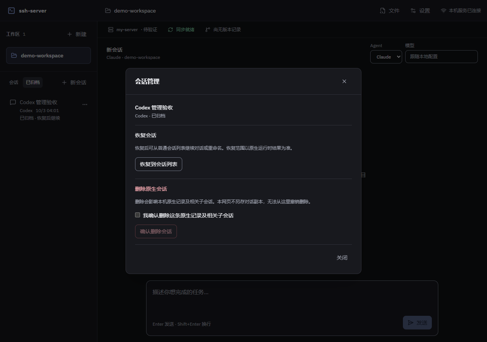

# 原生会话管理验收

日期：2026-10-03；开发基线：`164175e`。本阶段完成 Claude/Codex 原生重命名、删除，以及 Codex 归档列表、归档和恢复。设计与范围见 [管理设计](../superpowers/specs/2026-10-03-session-management-design.md) 和 [实施计划](../superpowers/plans/2026-10-03-session-management.md)。

## 真实原生与网页验证

验收只使用本次临时合成的原生记录，不调用模型或 SSH，不操作用户历史。两类官方 SDK/app-server 均实际运行；网页管理走真实 Fastify 会话路由、会话服务、TurnManager 和原生接口，未用成功响应替身替代管理操作。

| 场景 | 已验证结果 |
|---|---|
| Codex 管理 | 官方 app-server 0.156.1 与网页完成重命名、归档、归档列表/读取、恢复及删除；原生列表与存储同步更新 |
| Claude 重命名 | 临时原生记录通过真实 SDK `renameSession` 实验，原生读取确认新名称 |
| Claude 删除 | 网页明确确认后，经真实后端与 SDK `deleteSession` 删除临时记录，原生列表/文件结果一致 |
| 归档限制 | 本机 Codex 0.156.1 的 `thread/name/set` 不支持归档记录；归档视图仅提供恢复/删除，恢复后可从普通列表改名 |

上述证据覆盖网页与原生存储/API。未观察 VS Code 插件界面刷新或 CLI 交互列表，因此 A8 尚未整项完成；不把原生文件更新等同所有客户端界面已验证。

## 范围与状态保护

- 管理前验证原生 ID/cwd，Claude 缺少 cwd 时拒绝修改；Codex 拒绝已知 active 状态和内部子代理。
- 管理与对话共用 `(agent, sessionId)` 锁，覆盖准备、运行及同步收尾；后台轮次占锁时返回 409，失败释放本次锁。同 ID 的不同 Agent 不相互阻塞。
- 删除须明确勾选，说明原生记录及相关子会话的影响；归档说明派生子会话影响，恢复范围以官方结果为准。
- 等待原生结果期间禁用重复提交和关闭；失败保留条目，匿名错误与重新读取/重试已验证。请求发出后不把网页断开当成回滚。
- 成功后刷新对应来源，删除/归档只清空仍匹配工作区、Agent、ID 的当前对话；迟到结果不清空新选择。本后端的锁不承诺控制其他原生客户端的并发。

## 界面与工程检查

“更多”会话管理 dialog、明确删除勾选、等待状态、后台运行锁错误与重试已通过浏览器验收；非等待状态下的 Esc 关闭及焦点恢复通过。960、1280、1920 像素宽度均无横向溢出。下图为实际查看的 1280 像素截图。

核心目标 review 无阻断项。14 个相关测试文件、126 项测试全部通过；会话管理及关联模块的定向覆盖率为语句 91.29%、分支 87.32%、函数 86.84%、行 94.43%，报告位于 `coverage/session-management`，不是全仓覆盖率。全局类型检查、相关 ESLint、改动范围格式检查及前端构建通过；构建保留既有大于 500 kB 的 chunk 提示，jscpd 重复行比例 0.48%，低于 3% 门槛。

## 剩余范围

- A8：独立观察 VS Code 插件界面和 CLI 交互列表中的删除结果。
- M4：skills / `/` 命令、上下文状态与压缩、模型目录仍待后续实现；本阶段完成不代表整个 M4 完成。
- M5/M6 与 A5/A13/A7：终端、资源面板、完整并发和原有真实 SSH 串联待办不变，仍需指定可验收的 Host 与目录。
