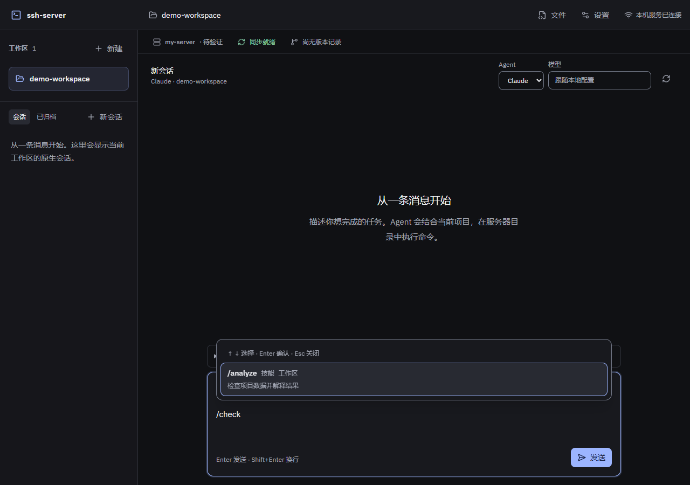

# 原生命令输入补全验收

日期：2026-10-03；开发基线：`799423b`。本次补齐 M4 的 `/` 自动展开，沿用[原生能力阶段](native-capabilities-acceptance.md)的目录、ID 选择和服务端校验，不改变模型运行时或同步行为。

## 交互

消息开头输入 `/` 展开技能/命令候选，继续输入可搜索名称、别名、描述和来源。输入框保留焦点，上下方向键选择、Enter 确认，保留附加参数后再发送；Esc 收起并保留原文，Shift+Enter 换行。路径、正文、参数区和非空选区不触发补全。禁用及需要已有会话的条目显示原因，不能被选中。

采用 MIT 的 Ariakit 0.4.40 combobox/textarea；界面沿用现有中性深色，应用 UI UX Pro Max 的键盘导航、可见焦点和无遮挡建议。候选最多显示 20 项，目录读取复用原缓存，不按每次按键启动原生进程。切换工作区、Agent 或会话时销毁旧浮层；选择仍仅发送能力 ID。

## 验证

实现后审查核心目标，再增加 3 项纯函数测试，覆盖触发范围、参数保留及两入口共享搜索。浏览器使用合成目录和 WebSocket 事件，没有调用模型或 SSH；不重复此前已通过的 164 项原生能力测试及真实 GLM 验收。

- 浏览器验证首次展开、别名过滤、方向键选择、首次 Enter 只选择、再次发送仅含 ID、焦点保留及目录缓存。
- 验证已有参数、路径/正文/参数区、禁用项、Esc、Shift+Enter、输入法组字、Agent 切换、目录慢请求及失败后的普通发送。
- 检查 960、1280、1920 三种宽度，无横向溢出；实际查看候选及输入区截图。
- 修复输入和光标更新时的补全范围滞后，以及候选确认后同一次 Enter 继续发送的问题。发送判断在组件转发候选键盘事件前执行。

前端类型、相关 ESLint/格式和构建通过；新增解析模块的 3 项测试通过，定向覆盖率行/语句/函数 100%、分支 90.9%。jscpd 重复行比例 0.49%。主包 gzip 331.21 kB，较上一阶段增加约 42 kB；仍有既有的大包提示。

后续文件管理、终端/资源、真实 SSH/rclone 与原生长会话负载已有[独立证据](real-workflow-acceptance.md)，本次补全验收不代替。独立客户端刷新、原生 OS 输入法及 Edge 系统选择器仍见[剩余范围](../engineering/remaining-scope-audit.md)。
