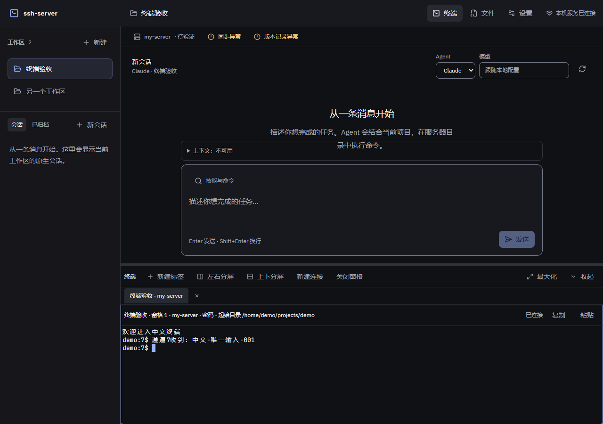
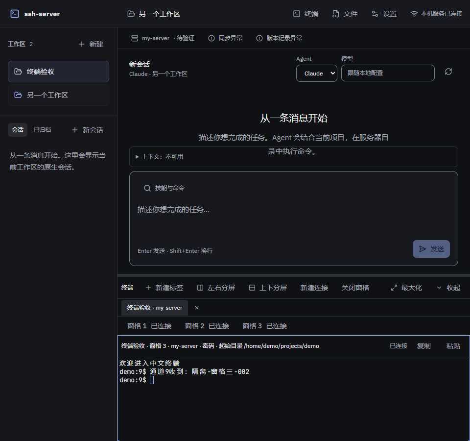
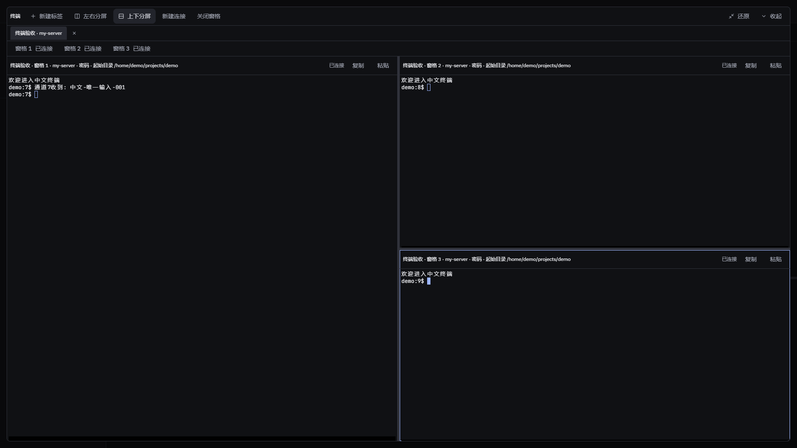

# 网页终端验收记录

日期：2026-10-05。对应[需求F4/A10/A12](../product/requirements.md)、[设计](../superpowers/specs/2026-10-04-web-terminal-design.md)、[计划](../superpowers/plans/2026-10-04-web-terminal.md)和[实施决策](../engineering/web-terminal-decisions.md)。本页记录终端基础阶段，不代表整个项目完成。

## 1. 实现与核心审查

已接入固定目标签名、受保护的SFTP目录确认、独立PTY/WebSocket、有界输入与双流输出、多标签/嵌套分屏、可调主区、复制粘贴及明确新建连接。收起、最大化、切换聊天和窄屏仅改变布局，保留原有窗格实例。

一次全分支独立Review使用新上下文的gpt-6.1-sol，未使用astra或续接历史代理。7项P2均已修复：私钥配置指纹、启动退出监听空窗、EOF误判、活跃WS关闭、bracketed paste、guarded SFTP错误移交及启动resize。每项复现先失败、修复后通过；修复后仅复验相关范围。

1项P3留给工作区删除生命周期：已有终端收起后，如果最后一个工作区被删除，顶栏入口可能无法再次展开。后续实现删除入口时一并处理，不能将其从整项目待办中删除。

## 2. 工程证据

- 全仓门禁的typecheck、ESLint、Prettier和jscpd阶段通过，重复率0.38%。初次coverage暴露核心路径缺口后，补固定标签与runtime回归，未降低阈值或增加排除项。
- 最终 `npm run coverage`：82个测试文件通过、1个跳过；601项测试通过、5项跳过。语句85.88%、分支79.08%、函数87.83%、行89.80%，退出码0。
- 关联回归覆盖绑定篡改/过期/删除/配置替换、晚到通道、初始化回显/中文/超时、EOF/真实退出、输入输出背压、消费确认、8/32名额、慢消费者、心跳、HTTP/WS安全边界及64KiB控制帧。正常聊天大帧保留兼容。
- 网页核心回归覆盖固定标签、迟到绑定、4叶限制、启动resize、退出终态、粘贴取消、隐藏保留和write完成后ack。新增runtime回归及类型/ESLint检查通过。
- 修复后的生产网页build通过；终端单独lazy chunk约359.92kB，gzip93.60kB。主入口仍有构建体积提示，后续界面/长会话阶段处理。

## 3. 实际网页与通道检查

运行 `node --import tsx scripts/dev/e2e-terminal.ts`，使用随机本机端口、临时密钥/known_hosts/工作区及真实ssh2握手。终端绑定、目录确认、独立PTY、二进制输出、消费ack和窗口事件走产品实现。同步、版本和对话外围使用受控scaffold；这里的SFTP检查是新开真实通道，对话检查是另一WebSocket的echo，不将它们记为实际rclone或模型运行验收。

Chrome/Playwright在960、1280、1920宽度实际渲染，控制台错误列表为空。完成以下核对：

| 检查 | 实际结果 |
|---|---|
| 布局与身份 | 左右/上下分屏、相邻关闭、最大化、收起、聊天切换后原pane DOM身份保留；960×500切为覆盖层，恢复后保留分屏；无整页横向溢出 |
| 输入隔离 | 不同随机标记仅进入所选PTY；中文通过composition事件发送并在SSH输入记录中核对 |
| 复制粘贴 | 鼠标选择复制中文成功；多行确认前不发送，确认后保留剪贴板实际字节。Windows会将剪贴板LF规范化CRLF，按读取后的基准比较 |
| 终端协议 | ANSI、备用屏幕和鼠标事件可用，实际输入包含鼠标ESC序列及Ctrl+C字节；bracketed起止帧完整；OSC52未改写用户剪贴板 |
| 退出与隔离 | exit=7和最终输出保留；关闭相邻窗格后继续输入，其他PTY、新SFTP和另一WS继续响应 |
| resize与回收 | 所有记录尺寸均非零；网页关闭后累计9个PTY全部closed，未留活跃shell |

目录失败、启动/断线、拥塞/超时和资源收尾的错误路径由核心回归核对。页面截图中的同步或版本状态来自外围scaffold，不能据此判断真实同步/版本功能。

验收进程已停止；工具中断未触发Windows信号清理的临时目录，经核对仅含本次fixture工作区配置和空目录后已删除。未留下本次夹具密钥、访问令牌或工作区配置。

## 4. 验收边界与后续

原生OS输入法尚未实测：composition事件模拟证明产品不误拦组字快捷键，但不能代替真实中文输入法候选与提交体验。真实服务器已有htop/nvitop/Slurm等全屏工具、实际密码保存重启后的终端串联仍需核对，因此A10/A12不标完整通过。

Agent配置 `config_bq.toml` 属于模型中转配置，不作为SSH目标。用户已授权自主继续；后续从本机既有SSH配置和工作区事实恢复目标，使用可确认目标的独立临时目录，不再重复请求阶段确认，也不把真实连接信息写入仓库。

资源面板、多活动与实际rclone并发尚未接入/验收，A18及架构V16继续待办。终端本机基础阶段达到可整合基线，整个项目仍按[剩余范围](../engineering/remaining-scope-audit.md)推进。
