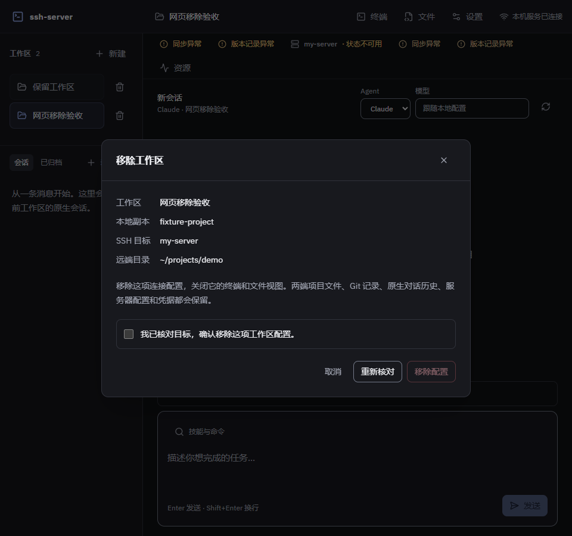
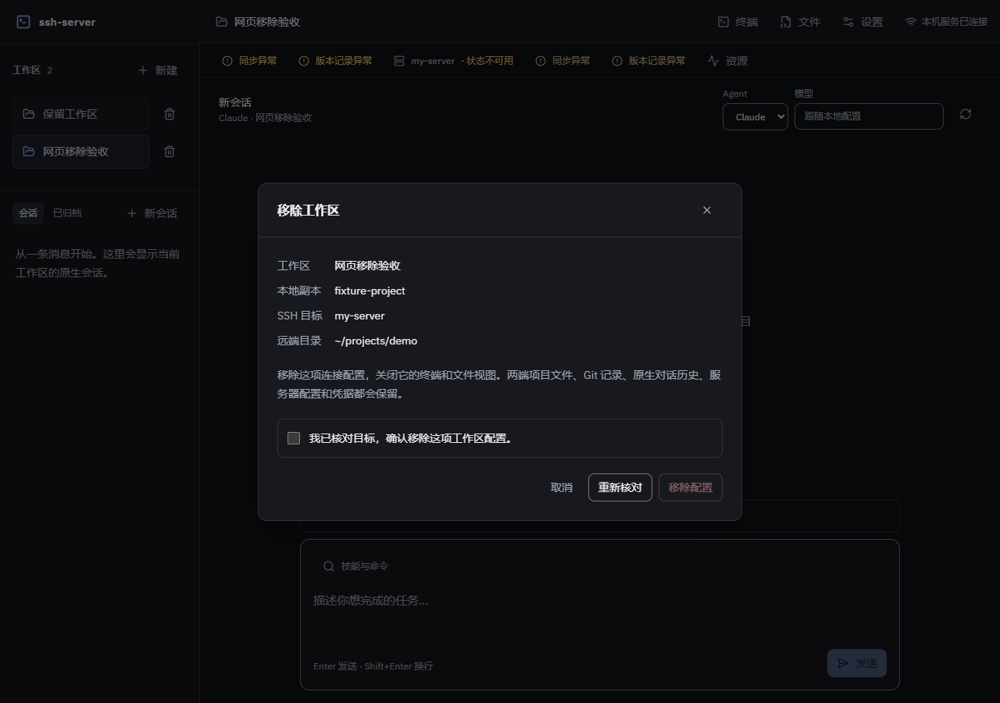
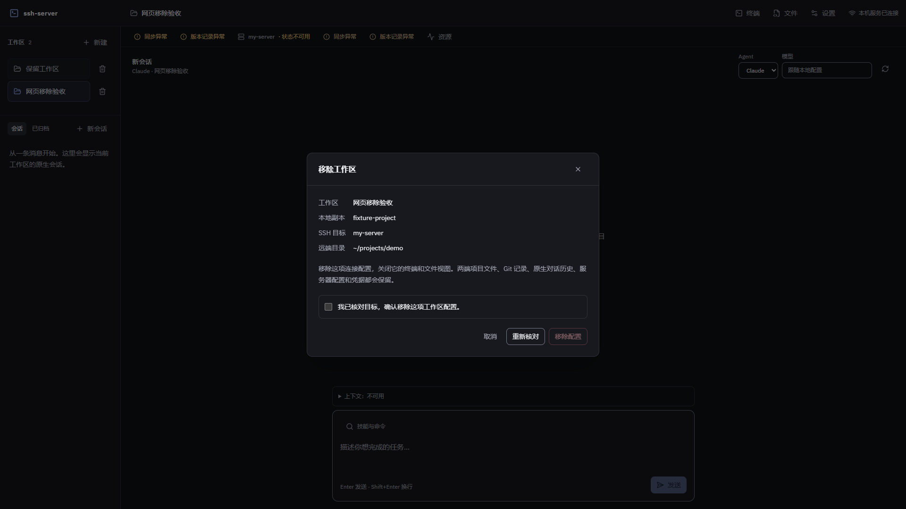

# 工作区配置移除验收

日期：2026-10-05，对应F1.5、D22/D23。[设计](../superpowers/specs/2026-10-05-workspace-lifecycle-design.md)与[计划](../superpowers/plans/2026-10-05-workspace-lifecycle.md)。真实参数仅来自ignored配置，公开截图使用通用目标。

## 核心边界

移除只保存配置变化，保留两端项目、Git、原生历史、服务器表、凭据和磁盘任务/同步状态。短请求、完整轮次和初始化持租约；未解决跨工作区文件任务、同步队列/remoteTask、干净及离线编辑器阻断移除。确认绑定摘要，保存失败可重试，保存成功但清理异常返回已移除及警告。

核心回归覆盖互斥/幂等/解锁、文件与另一记录保留、陈旧确认/写盘前阻断、保存失败/清理异常、预览、离线登记、持久同步任务、全部清理尝试、初始化成功/失败租约。复用任务和轮次夹具验证异步复验前全部工作区租约、部分获取失败释放、冷启动超过100条任务、准备至同步收尾。网页覆盖默认确认、阻断、失败/重新核对、重复提交、最后一项清空、迟到结果及缓存/终端隔离。

## Review与修复

一次独立核心Review：Critical0、Important2、Minor0，使用gpt-6.1-sol，未调用astra或续接旧代理。两项问题先复现再修复：普通HTTP伪造Upgrade头曾使实际原生会话写入等待期间DELETE返回200，改用插件真实升级标记后返回409；弹窗外部卸载曾跳过宿主面板收尾，业务回调独立于挂载后关闭所属文件面板。

浏览器另发现静态页面空响应，回归先得到空正文，限定onRoute包装到工作区路由后页面/资产正文通过。HTTP提前发送/真实断开仍等待handler，由Review实际Fastify实验验证；真实WS不占HTTP租约，由现场验收验证。

未判断范围裁定：通道/网页补现场证据；配置移除无原生provider删除调用，测试保留磁盘哨兵，不声称独立客户端刷新已验；损坏记录恢复和外部活动沿用原边界，不强停服务器进程。用户要求实现及Review后补核心回归，不重复派审。

## 真实SSH与网页

可信私钥目标下mktemp创建唯一测试目录。两个工作区同时打开实际ssh2 PTY/SFTP，移除第一项后所属WS关闭、浏览会话失效；第二项PTY执行随机标记命令、SFTP继续读取。两条真实WS打开后普通租约均为0。读取两端代码/`.git`哨兵，内容保留；另一配置与共享SSH可用。仅清理已核对归属的远端唯一测试目录，本地证据保留ignored目录。

Edge960/1280/1920分别提交实际DELETE，默认未确认、禁用按钮、保留说明、配置收尾通过，两端文件保留，无pageerror或横向溢出。无关会话/同步展示使用夹具，未注册接口返回404，不作为M6组合验证。截图仅替换展示文字，不改变真实请求。

## 工程验证

jsdom固定版本移至根开发依赖，保证干净安装时Vitest可解析。首次全量覆盖率暴露既有恢复测试时序：sync_pending也是远端完成后的传输中间阶段，原活动未结束时恢复正确返回状态；夹具等待显式恢复进入拉取，不改变产品语义或门槛。

阶段 `npm run check` 通过：95个测试文件通过、1个跳过，667项通过、5项跳过。语句85.75%、分支79.05%、函数86.19%、行89.49%；类型、ESLint、格式和重复率0.39%通过，网页构建通过。[PR #9](https://github.com/Heaven-y/ssh-server/pull/9)的[双平台CI37239963839](https://github.com/Heaven-y/ssh-server/actions/runs/37239963839)成功，两级--no-ff合入feat faeff6d与main f19a84d并推送，小分支确认合并且无占用后删除。[主线CI37240392028](https://github.com/Heaven-y/ssh-server/actions/runs/37240392028)最终双平台成功：首次Linux实际SSH向导测试超过5秒，已读取日志并增量复验该文件；同一提交重跑失败作业通过，记录首次超时而不修改产品或断言。后续产品设置、规则、导航/概览、长会话及净差异已交付，实际 M6 组合见[完整链路](real-workflow-acceptance.md)；本页删除证据保持原范围，整个项目未验项见[范围核对](../engineering/remaining-scope-audit.md)。
