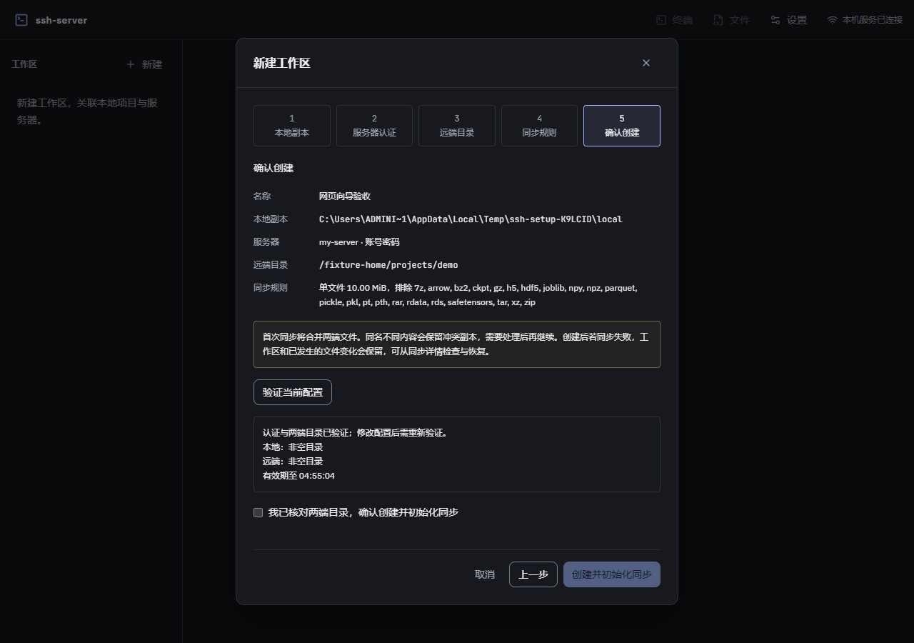

# 工作区连接向导验收

日期：2026-10-05。对应F1.1–F1.3、F1.6–F1.8、F5.2。设计见[连接向导](../superpowers/specs/2026-10-05-workspace-setup-design.md)。真实连接仅保存在本机ignored参数中。

## 已实现行为

五步选择名称及本地副本、服务器认证、远端目录、同步规则和确认创建。导入SSH Host与独立servers.json手动目标共用resolver；手动保存连接在取消工作区后保留，不改写SSH config、不保存密码正文。两端逐级分页浏览仅返回元数据；远端大小按需du，预览按需使用本机固定版本rclone的独立lsjson。

主机指纹来自不发送认证凭据的实际握手；未知公钥经明确勾选后追加known_hosts，变化与吊销拒绝。两分钟一次性挑战绑定目标、信任记录和实际公钥。最终验证票绑定快照、认证身份/代次、本地根身份及规范远端路径，五分钟有效；创建开始及串行队列写盘前均复验。保存后显示首次同步实际结果，失败保留配置。

## 核心审查与回归

一次独立Review发现两项Important，均已裁定修复；无Critical或Minor。三条回归先失败后通过：远端根在读取目录期间换链接必须拒绝；创建开始和写盘前复验的resolver挂起时，取消必须释放操作且不保存。修复采用结束时根复查及每轮检查取消/截止race，同步初始化拒绝链接重定向。最后检查后的任意外部文件系统变更不被描述为已锁定。

核心回归覆盖手动目标重启与统一身份、严格字段、信任匹配/变化/吊销/陈旧/过期/重放、草稿分页和关闭、预览过滤/.git/取消/上限及临时状态清理、快照/配置/代次/目录/过期/撤票拒绝、并发重放仅创建一次、初始化失败保留配置和生产HTTP不可绕过验证。Windows额外使用真实DPAPI验证手动目标经新后端实例复用密码并读取草稿目录；Linux不执行该平台专属用例。

React测试使用Testing Library和jsdom实际挂载Hook，7条生命周期回归覆盖StrictMode、步骤门禁、未应用规则、新请求替代旧请求、迟到票撤销、提交期间禁止关闭、成功后列表刷新、创建失败/过期重试及外部卸载后不切换工作区。jsdom固定27.4.0以兼容当前Node 22.20，未扩大覆盖率排除。

## 真实SSH与rclone

使用已授权可信私钥目标，在其允许目录下创建独立临时子目录；本机rclone 1.75.1下载后通过官方SHA256校验，没有在服务器安装软件。

- 草稿SFTP目录浏览、按需du与两端只读预览通过，预览前后远端文件列表相同；无同步基线或临时预览目录残留。
- 验证票创建和首次双向初始化返回ready，本地/远端小文件互达，权重未下载，.git不纳入清单，重放票拒绝。
- 符号链接根在向导验证和同步初始化均被拒绝。
- 本地和远端临时目录均已删除并确认。

## 网页

真实本机ssh2/SFTP夹具配合headless Edge验证960、1280、1920宽度：五步内容、错误焦点、键盘入口、无页面整体横向溢出及pageerror。指纹检查/确认前后认证计数均为0；密码测试后DOM为空，返回撤票，无票不能创建。初始化失败显示已创建及保留配置，提交一次；打开、取消、重开清空草稿字段并关闭SFTP通道。

补充网页验收通过手动保存连接、取消后再次选用、真实Windows加密保存与无密码重连；预览返回和验证关闭后的迟到响应不写入新步骤、不创建工作区。网页夹具的远端预览清单和首次同步是合成结果，真实rclone证据为上一节的独立验收。

另有[960截图](../assets/workspace-setup-960.png)和[1920截图](../assets/workspace-setup-1920.png)。

## 工程与后续

类型、ESLint、Prettier、重复率及网页构建通过。最终覆盖率649项通过、5项跳过；语句85.71%、分支79.14%、函数86.23%、行89.50%，保持既有门槛和排除项。一次Review后新增36条核心回归，双平台CI及合并结果随整合记录补充。

首次阶段门禁641项通过，但语句覆盖84.04%低于85%，补充实际Hook回归后复核。期间两项既有文件任务时序断言在覆盖率负载下失败，关联17项单独通过；正文证明核对等待活动控制器收尾，跨工作区迁移仅该用例允许5秒等待多轮原子写盘，保持锁序、实际结果和不重放断言，不改产品或全局超时。

本阶段完成连接创建的范围；产品默认设置、删除生命周期、顶栏概览及完整M6并发继续实施。密码与实际rclone、终端的完整组合仍属A12后续验收，网页合成初始化不代替该证据。

整合记录：[PR #8](https://github.com/Heaven-y/ssh-server/pull/8)在797a487上的[双平台CI 37234735439](https://github.com/Heaven-y/ssh-server/actions/runs/37234735439)通过；以--no-ff合入feat/ssh-workflow（5147dc0）及main（7845821），均已推送，[main双平台CI 37235267430](https://github.com/Heaven-y/ssh-server/actions/runs/37235267430)成功。已确认合并且无工作树占用的向导小分支在本地与远端删除，feat保留。
