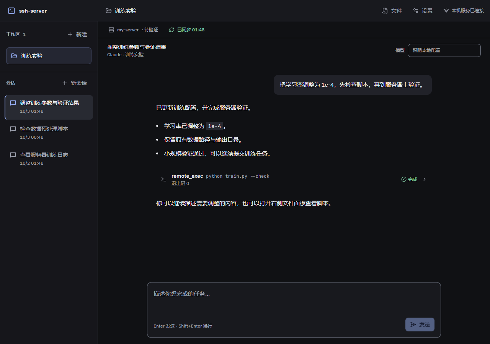

# 工作区界面改版验收

日期：2026-10-03。依据 [参考调研](../product/ui-reference-review.md) 和 [设计](../superpowers/specs/2026-10-03-workspace-ui-design.md)，实现中性深色的对话工作区。

## 已实现

- 中性背景、减少装饰分隔、蓝色主操作，成功/待确认/危险使用独立语义色；对话正文与输入区采用更清楚的字号和行距。
- SSH 与同步从常驻大块表单收为单行状态摘要，点击打开详情。失败、暂停、待确认与凭据状态读取失败仍可见；网页连接明确标为本机服务。
- 业务 Hook 保持挂载，关闭详情不会停止同步调度或丢失已验证连接状态。原生详情弹窗处理焦点、Escape 和滚动。
- 工作区和会话独立滚动；新建表单移到合适宽度的模态中。连接测试可以取消，真正创建期间禁止关闭；迟到创建结果不切换已经离开的工作区。
- 会话标题复用现有列表标题；工具保持默认折叠；审批、IME、发送/停止、流式贴底与文件草稿语义保持。

下图是本机开发页的实际渲染，内容来自受控验收数据，并非一次真实训练结果。

## 验证结果

- 24 项既有前端测试通过，覆盖会话状态、事件归约、API 与可见性同步调度；没有为纯样式添加镜像测试。
- 综合浏览器验证通过：详情关闭后仍定时同步、页面隐藏暂停、密码发送即清理/重开为空、延迟 SSH 测试可取消、延迟创建禁止关闭、成功后选中新工作区、IME/Shift+Enter/发送/停止及批准/拒绝。
- 验证原生详情弹窗关闭后焦点回到触发按钮。审核发现的连接测试取消回归、浏览器发现的卸载时焦点丢失均已修复。
- 文件编辑与原生设置的浏览器流程分别复验通过，包含保存/同步分离、工作区绑定、冲突保留、CRLF、语法校验、关闭清理和正文不持久缓存。
- 已实际查看 960/1280/1920 主界面，以及同步就绪/删除待确认、SSH 密码、新建表单、审批、空状态、文件编辑和设置截图。横向布局无溢出，主要底部操作可见。
- 从主题变量计算对比度：主文字最低 12.45:1，辅助文字 5.89:1，成功/待确认/错误文字至少 7.50:1，强边界 3.33:1，主按钮文字 7.92:1。该计算不替代全部辅助技术手动验收。
- TypeScript、前端 ESLint、格式和构建通过。继续保留主包与编辑器 chunk 大于 500 kB 的构建体积提示。

## 范围

本阶段使用受控 HTTP/WebSocket 与界面状态验证，不重复调用真实模型或服务器，不将演示文字记为模型/SSH 验收。后端认证、同步门禁和数据协议未改动。浅色切换、可拖动分栏、版本历史、Codex 网页适配、终端和资源面板仍按路线图推进。
