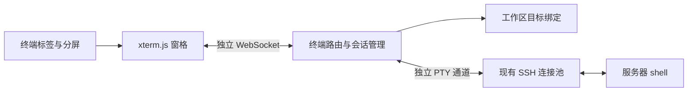

# 网页 SSH 终端设计

日期：2026-10-04。状态：已自查，用户已以“确认 继续”认可；[实施计划](../plans/2026-10-04-web-terminal.md)已编写并自查，待书面审阅。尚未安装依赖或实现产品代码。

依据：[需求 F4、A10、A12、A18](../../product/requirements.md)、[界面布局 5.3](../../product/ui-layout.md)、[架构 2.2、5.4](../../engineering/architecture.md)及设计决策 D19、D20。所属大分支为 `feat/ssh-workflow`，本阶段小分支为 `codex/ssh-workflow-terminal`。

## 1. 目标与范围

用户在本机网页直接操作工作区服务器，默认进入该工作区的远端目录；可同时使用多个标签和分屏，调整区域大小，复制、粘贴以及运行服务器已有的全屏程序。终端与对话、文件操作和同步分别反馈状态，不调用模型，不经过 Agent 命令黑名单，也不要求执行前同步。

本阶段交付 F4 终端及其生命周期；完整连接向导、资源采样另按 M5 推进。服务器沿用已有 SSH 和 shell，不安装终端服务、复用器或新软件。终端不自动提交训练、识别任务完成或触发结果分析。

## 2. 方案选择

| 方案 | 通道与会话 | 主要取舍 |
|---|---|---|
| 每窗格独立 WebSocket 和 SSH PTY（采用） | 同一连接池内分别打开 `shell()` 通道；网页持有会话 | 单个窗格可独立限流、关闭和报错；多窗格会增加本机 WebSocket 数量 |
| 一个 WebSocket 复用全部 PTY | 帧携带窗格 ID，统一转发 | 连接数量少；需要额外处理调度、公平性及断线后的全部窗格状态 |
| 服务器会话复用器 | 通过服务器已有 tmux 等保存远端会话 | 可延续断线前 shell；依赖服务器能力，还需处理复用器身份与恢复契约 |

首版采用每窗格独立连接、网页存活期间保持会话。WebSocket 或 SSH 断开后，本次终端结束；用户点击“新建连接”才创建新的 shell，不承诺恢复原进程，不重发断线前的输入。

## 3. 模块与数据流

- `ssh/pool.ts` 增加 PTY 开启入口，复用现有 resolver、客户端缓存、认证代次及 `known_hosts` 校验；不另建 SSH 客户端或凭据存储。
- 后端 `terminal/` 负责固定目标、初始化、输入输出、流量控制与释放；HTTP 层只负责协议验证及注册，不承担终端业务。
- 共享包新增独立终端控制消息 schema，不扩展聊天消息或混入 Agent 事件。
- 前端 `features/terminal/` 负责标签、布局和每窗格连接；xterm 模块在首次打开终端时加载。App 根部保留已创建窗格，切换聊天和收起终端不卸载它们。
- 使用成熟的 `@xterm/xterm`、`@xterm/addon-fit` 和 `react-resizable-panels`。标签与操作菜单沿用现有可访问组件；不引入新的 UI 框架。

## 4. 目标绑定与安全边界

打开标签时固定工作区 ID、SSH Host 别名、认证方式和远端起始目录。浏览器先向 `POST /api/workspaces/:id/terminal-binding` 提交预期目标；后端重新读取工作区及 SSH 配置指纹，返回与该目标绑定、有效期 5 分钟的不透明令牌。`/api/workspaces/:id/terminal` WebSocket 首帧携带该令牌，后端再次核对当前配置后才开启 PTY；令牌有效期只限制开启时机，不结束已打开的终端。客户端不能传入任意地址、用户名、密钥或启动命令，令牌不暴露实际连接配置。

每个窗格始终展示工作区、Host 和“起始目录”；用户在 shell 内执行 `cd` 后，标题不将旧路径标为实际当前目录。切换聊天不改变既有窗格目标。新增分屏使用所属标签的固定目标，不跟随当前聊天；为另一工作区创建终端必须通过明确入口。

新建连接前重新验证工作区目标和 SSH 配置指纹。配置变化、工作区被删除或绑定失效时拒绝沿用旧标签；用户重新打开当前配置下的终端。已经打开的通道固定在原 SSH 客户端上，不随配置变更转向新服务器。密码变化或主动断开导致认证代次变化时，关闭该目标的旧 PTY；仅关闭窗格不会调用连接池 `disconnect()`。

已有标签新增分屏或新建连接时，提交原绑定刷新令牌；即使原令牌已过期，也必须核对其签名仍对应同一目标、配置指纹和认证代次。只有身份未变化才签发新令牌，不能仅重新读取当前配置，让旧标签悄然连接另一服务器。刷新不改变既有 PTY，开启 PTY 时仍要求新令牌在 5 分钟有效期内。

终端 WebSocket 使用 `/api/` 下的独立路由，沿用 Host、Origin、HttpOnly 会话 Cookie 校验。服务器或浏览器日志不记录输入和输出正文，不持久化终端历史、密码或连接令牌。不响应终端 OSC 52 自动写剪贴板，不让远端标题覆盖固定目标，不自动打开远端输出中的链接。

## 5. 启动与默认目录

1. 后端在固定认证代次内，通过独立 SFTP 通道解析工作区远端目录为绝对路径，确认目录类型，随即释放 SFTP 通道；此步骤只读取元数据，不扫描目录内容，实际进入权限由后续 `cd` 确认。
2. 在同一目标上用 `ssh2.shell()` 请求 PTY，`TERM=xterm-256color`，使用首次可见布局测得的行列数。
3. `shell()` 没有 cwd 参数，因此后端发送一条由固定模板生成的 POSIX 初始化语句：安全引用绝对目录，进入成功后输出随机确认帧，失败则输出失败帧并退出。路径不得包含 NUL 或换行，单引号等字符沿用现有 POSIX 转义；用户输入在初始化完成前不进入通道。
4. 初始化解析器处理跨 chunk 的确认帧；确认前的引导输出不转发给 xterm。收到成功帧才进入可输入状态，此后输出按原始字节转发。进入失败、shell 不兼容或确认超时都关闭本次通道，界面说明“未进入工作区目录”，不在家目录继续开放输入。

本项目现有远程命令已按 Linux/POSIX 环境设计；首版不扩展 Windows 远端 shell。初始化不加载自定义环境脚本、不安装软件，也不向服务器写启动文件。登录 shell 自身的环境配置仍由服务器决定。

## 6. WebSocket 与流量控制

一个 WebSocket 只拥有一个 PTY，会话 ID 由后端生成。首次控制消息包含工作区、预期目标、绑定和尺寸；后续控制消息支持输入、resize、消费确认和关闭。输出使用二进制帧，xterm 直接接收 `Uint8Array`，保留跨帧 UTF-8 解码、ANSI、鼠标协议及全屏程序状态。xterm `onData` 用 UTF-8 编码，`onBinary` 按原始字节转发。

控制帧严格校验，未知类型和非法尺寸不能到达 SSH。后端在 `shell()` 回调前遇到取消，必须记住取消状态；迟到通道立即释放，不登记为活动会话。自然退出先依序发送剩余输出，再通知实际退出码或信号并关闭 WebSocket；发送失败明确报告未完整显示，未知结果不标为退出码 0。客户端的已退出终态不能被随后 WebSocket close 覆盖成断线。

首版限制如下；实施中如需调整须同步记录原因及证据：

| 参数 | 值与行为 |
|---|---|
| 初始尺寸 | 可见窗格实测；无法测量时 80 列、24 行；隐藏窗格不以零尺寸发送 resize |
| 接受尺寸 | 行列均为 2–500 的整数；pixel 尺寸不由用户任意传入，调用 `setWindow(rows, cols, 0, 0)` |
| 启动时限 | 开始解析目标至目录确认共 30 秒；PTY 打开后的目录确认最多 10 秒 |
| 初始化输出 | 最多 128 KiB，超限结束本次终端并说明初始化失败 |
| 单次输入 | 最多 32 KiB；大段粘贴分块处理，包含换行时先由用户确认将在 shell 执行 |
| 输入队列 | 每窗格待写最多 256 KiB；SSH `write()` 返回 false 时等 drain，超限停止接收并结束该窗格，不截断后继续执行 |
| 输出消费 | 每个二进制输出帧最多 32 KiB；浏览器在 xterm `write` 回调后按字节确认消费，确认量不得超过已发送未确认量 |
| 输出背压 | 未确认输出达到 256 KiB 或 WebSocket `bufferedAmount` 达到 64 KiB 时暂停本 PTY 的 stdout/stderr；全部降至 64 KiB 以下后恢复 |
| 应用缓冲上限 | 每窗格待发与未确认输出合计最多 1 MiB；超限结束该窗格并显示输出拥塞，不关闭共享 SSH；ssh2/ws 内部预取不计为应用队列，不宣称整个进程内存硬上限 |
| 慢消费者 | 有未消费输出且连续 60 秒没有有效消费确认时结束本窗格；仅空闲无输出不超时 |
| 存活检查 | WebSocket ping 间隔 20 秒，60 秒无 pong 结束本窗格；不以终端命令运行时间设置执行超时 |
| 会话数量 | 每工作区最多 8 个活动/启动中 PTY，后端合计最多 32 个；一个标签最多 4 个窗格，超限给出明确原因 |
| xterm 回滚 | 每窗格 2,000 行；不把完整终端输出存入 React/zustand 或浏览器存储 |

浏览器发送前同时检查连接状态和发送缓冲；发送缓冲达到 64 KiB 或后端通知输入暂停时，停用输入并提示，不能无限积累键盘或粘贴内容。等待 WebSocket 发送缓冲清空且后端恢复接收后，再开放新输入；终端重连时清空旧粘贴队列。取消粘贴只丢弃尚未发送的部分，已发送内容无法撤回，界面如实说明。初始化、输入和输出均只有有界队列；关闭时清理监听、计时器、缓冲与通道。

实施计划将浏览器单次待发送粘贴同样限制为 256 KiB，以保持暂停期间有界；超出时整次拒绝并提示缩小内容，不截断后执行。该限制补齐浏览器端的队列边界，与后端待写上限一致。

## 7. 标签、分屏与布局

实际查看了 Pebrel 的[终端分屏截图](https://github.com/Kuddev/pebrel/blob/main/docs/screenshots/split-ai-workflows.png)：侧边紧凑标签、细线分隔、相邻终端的独立区域适合借鉴。仅参考视觉与交互，不复制 GPL-3.0 实现或截图到产品资产；本项目继续沿用语义色与 JetBrains Mono。

- 顶栏新增“终端”入口。默认打开底部宽区，横跨对话和文件区，左侧栏保持；标签栏提供新建、关闭、左右分屏、上下分屏、最大化和收起。第一次打开创建当前工作区的一个终端，之后打开只显示既有终端，不重复启动 shell。
- 每标签是一棵最多 4 叶子的布局树；分屏创建新的 shell，关闭叶子合并剩余布局。窗格标题标明序号、Host、起始目录与连接状态，活动窗格有焦点边框，状态同时用文字表达。
- 拖动分隔线只改变尺寸，不重建 xterm、WebSocket 或 PTY；保留“左右分屏”“上下分屏”和键盘调整分隔线的入口。关闭窗格前说明将断开该 shell，不能保证其中前台进程继续运行；已退出窗格可直接关闭。
- 默认底部高度占可用主区 40%，至少 240px，保留上方对话至少 240px。空间不足时使用可关闭的覆盖层；“最大化”使用同一内容子树，仍能返回原布局。
- 960/1280/1920 宽度不出现整页横向溢出。空间不足时只显示活动窗格，其他窗格仍保持挂载和连接；恢复空间后还原分屏。隐藏窗格保留最后有效行列数，可见后再 fit。
- `ResizeObserver` 与 `requestAnimationFrame` 合并布局变化，fit 后仅行列发生变化才发送 resize。连续 resize 只应用最新尺寸，不让旧尺寸回写。
- 选中文本后 `Ctrl+Shift+C` 或“复制”写剪贴板；`Ctrl+C` 保留 shell 中断语义。`Ctrl+Shift+V` 或“粘贴”由用户触发读取剪贴板，权限不可用时提供普通粘贴入口；粘贴内容中的 CR/LF 均按多行预览确认，确认后原样分块发送，不额外追加 Enter。输入法组字期间不触发应用快捷键。
- 标签、菜单、关闭确认和分隔线均可用键盘；控制区不拦截终端的普通键，焦点在活动 xterm 和关闭后的相邻窗格之间正确恢复，使用 xterm 屏幕阅读器模式。

布局及活动标签仅在当前网页内存保存。收起终端、切换标签或聊天继续保持通道；关闭标签释放所属窗格，刷新/关闭网页或后端退出释放全部终端。关闭通道并不保证远端所有子进程退出，长任务仍需用户自行使用服务器已有后台方式提交。

## 8. 验收与阶段整合

核心实现完成并 Review 后，只补能证明关键目标的回归：固定目标与认证代次、目录确认和安全引用、迟到通道回收、二进制/UTF-8、resize、独立关闭、断线不重放及慢消费者限流。测试用临时目录与可移植 fixture，不写真实服务器信息或固定绝对路径；改动期间仅验证关联模块。

网页验收使用本机真实 ssh2 PTY fixture，实际检查中文输入、复制/多行粘贴、ANSI、备用屏幕、鼠标/键盘、分屏与尺寸变化。固定随机标记证明输入只进入选定通道；关闭一个窗格后其他 PTY、SFTP 和聊天仍工作。展示断线/拥塞/目录失败状态并核对最终所有通道和监听释放；三种宽度实际查看渲染，不只读取 DOM。

真实 A10/A12 验收仍只使用用户明确允许的 SSH 目标与独立临时目录，不因读取临时 Agent 配置而推断 SSH 授权。服务器已有的 `htop`、`nvitop`、Slurm 等按实际可用情况验证，缺少工具时报告缺失，不安装。资源面板完成后再验收 A18 和 V16 的完整并发，不把本机 fixture 等同于真实服务器验收。

书面设计已确认，独立实施计划待审阅；计划认可后按可审阅阶段将代码和正式文档一起提交。关联验证与核心 Review 完成后推送小分支并核对双平台 CI；使用 `--no-ff` 合入 `feat/ssh-workflow`，达到阶段基线再 `--no-ff` 合入 `main`。仅确认已包含且无工作树占用后清理小分支；大分支保留，未实施和验收的终端阶段不整合到主线。
